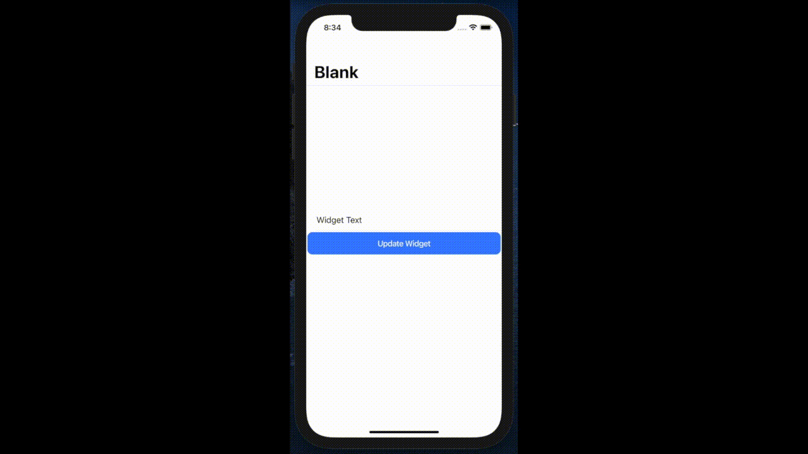

# capacitor-widgetsbridge-plugin

Capacitor plugin to interact with ios widgetkit

## Demo



## Install

```bash
npm install capacitor-widgetsbridge-plugin
npx cap sync
```

## API

<docgen-index>

* [`getItem(...)`](#getitem)
* [`setItem(...)`](#setitem)
* [`removeItem(...)`](#removeitem)
* [`reloadAllTimelines()`](#reloadalltimelines)
* [`reloadTimelines(...)`](#reloadtimelines)
* [`getCurrentConfigurations()`](#getcurrentconfigurations)
* [Interfaces](#interfaces)

</docgen-index>

<docgen-api>
<!--Update the source file JSDoc comments and rerun docgen to update the docs below-->

### getItem(...)

```typescript
getItem(options: UserDefaultsOptions) => Promise<DataResults<any>>
```

Return the value from user’s defaults database associated with the specified key

| Param         | Type                                                                |
| ------------- | ------------------------------------------------------------------- |
| **`options`** | <code><a href="#userdefaultsoptions">UserDefaultsOptions</a></code> |

**Returns:** <code>Promise&lt;<a href="#dataresults">DataResults</a>&lt;any&gt;&gt;</code>

--------------------


### setItem(...)

```typescript
setItem(options: UserDefaultsOptions) => Promise<DataResults<boolean>>
```

Set the value to user’s defaults database associated with the specified key

| Param         | Type                                                                |
| ------------- | ------------------------------------------------------------------- |
| **`options`** | <code><a href="#userdefaultsoptions">UserDefaultsOptions</a></code> |

**Returns:** <code>Promise&lt;<a href="#dataresults">DataResults</a>&lt;boolean&gt;&gt;</code>

--------------------


### removeItem(...)

```typescript
removeItem(options: UserDefaultsOptions) => Promise<DataResults<boolean>>
```

Remove the value from user’s defaults database associated with the specified key

| Param         | Type                                                                |
| ------------- | ------------------------------------------------------------------- |
| **`options`** | <code><a href="#userdefaultsoptions">UserDefaultsOptions</a></code> |

**Returns:** <code>Promise&lt;<a href="#dataresults">DataResults</a>&lt;boolean&gt;&gt;</code>

--------------------


### reloadAllTimelines()

```typescript
reloadAllTimelines() => Promise<DataResults<boolean>>
```

Reloads the timelines for all configured widgets belonging to the containing app

**Returns:** <code>Promise&lt;<a href="#dataresults">DataResults</a>&lt;boolean&gt;&gt;</code>

--------------------


### reloadTimelines(...)

```typescript
reloadTimelines(options: TimelinesOptions) => Promise<DataResults<boolean>>
```

Reloads the timelines for all widgets of a particular kind

| Param         | Type                                                          |
| ------------- | ------------------------------------------------------------- |
| **`options`** | <code><a href="#timelinesoptions">TimelinesOptions</a></code> |

**Returns:** <code>Promise&lt;<a href="#dataresults">DataResults</a>&lt;boolean&gt;&gt;</code>

--------------------


### getCurrentConfigurations()

```typescript
getCurrentConfigurations() => Promise<DataResults<any>>
```

Get current widget configurations

**Returns:** <code>Promise&lt;<a href="#dataresults">DataResults</a>&lt;any&gt;&gt;</code>

--------------------


### Interfaces


#### DataResults

| Prop          | Type           | Description                             |
| ------------- | -------------- | --------------------------------------- |
| **`results`** | <code>T</code> | Holds response results from native code |


#### UserDefaultsOptions

| Prop        | Type                | Description                                                           |
| ----------- | ------------------- | --------------------------------------------------------------------- |
| **`key`**   | <code>string</code> | The key whose value to retrieve from storage.                         |
| **`group`** | <code>string</code> | User defaults database name which holds and organizes key/value pairs |
| **`value`** | <code>string</code> | The value to set in storage with the associated key                   |


#### TimelinesOptions

| Prop         | Type                | Description                                                                                                    |
| ------------ | ------------------- | -------------------------------------------------------------------------------------------------------------- |
| **`ofKind`** | <code>string</code> | A string that identifies the widget and matches the value you used when you created the widget’s configuration |

</docgen-api>
